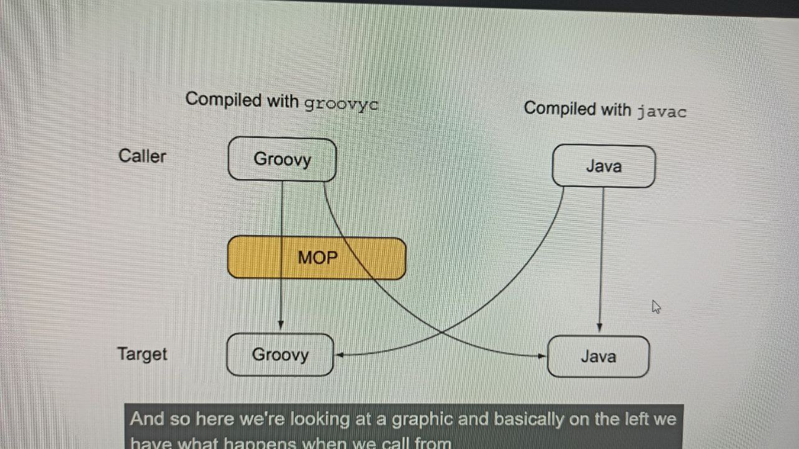
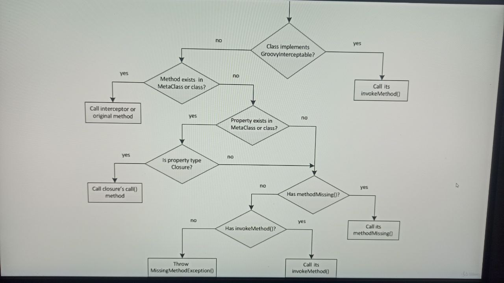

[Главная](README.md)

# Runtime Meta Programming

+ [Meta Object Protocol MOP](#Meta-Object-Protocol-MOP)

## Meta Object Protocol MOP

>Язык Groovy поддерживает два варианта метапрограммирования: во время выполнения и во время компиляции. Первый позволяет изменять модель классов и поведение программы во время выполнения, а второй — только во время компиляции. У обоих есть плюсы и минусы, которые мы подробно опишем в этом разделе.

>Ниже ссылка на официальную страницу Groovy, где очень хорошо описано метопрограммирование
> не вижу смысла сюда выносить выжимку, там все топ описано!
 
[Метапрограммирование официальная страница Groovy ](https://docs.groovy-lang.org/latest/html/documentation/core-metaprogramming.html "Метапрограммирование официальная страница Groovy")

__MOP__(Meta Object Protocol) - это протокол метаобъектов. 
>Это набор правил того, как запрос на вызов метода обрабатывается системой времени
> выполнения Groovy и как управлять промежуточным уровнем.

>На самом деле груви работает не банально - "дай класс Foo в котором метод bar например", 
> нет он обращается к промежуточному слою - "что мне здесь делать?" 
> - и на основе набора правил в дереве решений в зависимости от типа объекта
> - и этот промежуточный слой называется MOP 

>Ниже представлены вызовы с Java на Groovy и наооборот, и показана разница 
> - если мы создали Java class и вызываем его - то вызов происходит напрямую
> -  если мы создали Groovy class и вызываем его из Java - то вызов идет на прямую
> - если же мы вызываем из Groovy - Java class или Groovy class - то вызов идет через MOP 
> и в MOP есть набор правил, что мы можем сделать дальше

### Три разных типа объектов с которыми Groovy может работать при вызове из Groovy

- POJO - обычный Java объект, класс которого можно написать на Java или другом языке для JVM
- POGO - Groovy объект, класс которого написан на Groovy.Он расширяет java.lang.Object и
по умолчанию реализует интерфейс groovy.lang.GroovyObject 
- Groovy Interceptor - Groovy объект реализующий groovy.lang.GroovyInterceptable и имеет возможность перехвата методов

### Схема работы если мы вызвали из Groovy - groovy object(POGO)

[Вернуться в меню _Runtime-Meta-Programming_](#Runtime-Meta-Programming)

## Classes Fields Local Variables

[Вернуться в меню _Runtime-Meta-Programming_](#Runtime-Meta-Programming)

## Classes Fields Local Variables

[Вернуться в меню _Runtime-Meta-Programming_](#Runtime-Meta-Programming)
